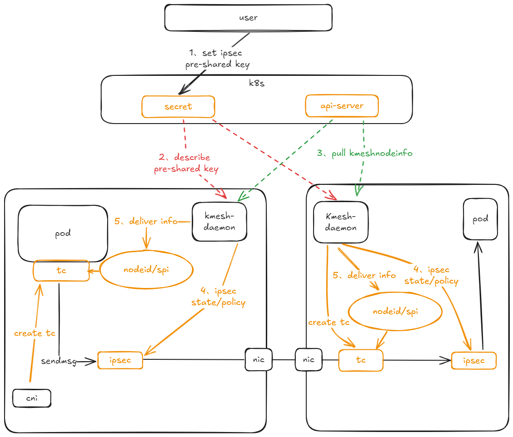
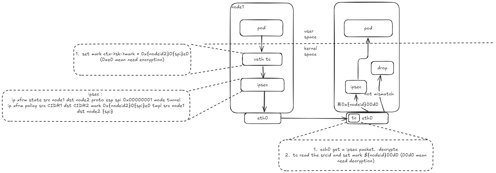

--- 
title: Kmesh支持节点之间进行数据加密
authors:
- "@bitcoffeeiux"
reviews:
-
approves:
-

create-date: 2024-10-10

---

## 1.背景

随着网络安全威胁的增加，未经加密的数据在传输过程中容易被黑客或第三方监听、截取甚至篡改，导致敏感信息泄露。为了解决上述安全风险，Kmesh计划引入节点数据加密模式，为节点之间的通信流量进行加密，消除通讯过程中的安全风险。

## 2.使用场景

由Kmesh进行代理的节点，在数据从应用发出时，路由到指定的网络接口设备进行加密处理后再经过网络发送给对端。对端由特定的接口接收到数据后进行解密，上送给对应的服务应用。

## 3.IPsec简介

IPsec是一个保护IP层通信的安全保密架构，是一个协议簇，通过对IP协议的分组进行加密和认证来保护IP协议的网络传输协议簇。运行在OSI模型的第三层（Internet Protocol，IP层），在VPN（virtual private networks）应用很广泛。
有关IPsec的更多描述请参阅[什么是IPsec](https://info.support.huawei.com/info-finder/encyclopedia/zh/IPsec.html)

## 4.Kmesh集成IPSec作为节点之间的加密工具

Kmesh仅使用IPSec的加密功能，IPSec的密钥由用户设置在K8s后，传递至Kmesh进行管理并设置到IPSec中，保证IPSec的正常通信。整体架构图如下：

### 4.1 用户设置IPSec密钥

用户通过kubectl向K8s中设置名称为Kmesh-ipsec-keys的secret类型资源，资源中有如下信息：

    [spi] aead-algo aead-key icv-len

该资源中包含有ipsec使用的spi编号，ipsec使用的密钥算法，ipsec使用的预共享密钥以及预共享秘钥长度

### 4.2 CRD设计

Kmesh使能ipsec时，需要精细化控制ipsec数据加密行为，这其中要求Kmesh具有节点之间的信息同步机制。当前主要场景基于云原生业务场景，信息同步机制基于K8s集群api-server构建，依赖Kmesh自定义结构体来完成数据存储。

CRD数据结构定义如下：

	apiVersion: apiextensions.k8s.io/v1
	kind: CustomResourceDefinition
	metadata:
	  name: knodeinfos.kmesh.io
	spec:
	  group: kmesh.io
	  versions:
	  - name: v1
	    served: true
	    storage: true
	    schema:
	      openAPIV3Schema:
	        type: object
	        properties:
	          spec:
	            type: object
	            properties:
                  name: string
	              spi:
	                type: integer
	                minimum: 1
	                maximum: 15
	              nicIP:
	                type: string
	              bootid:
	                type: string
	              cirds：
	                type: string
	scope: Cluster
	names:
	  plural: knodeinfos
	  singular: knodeinfo
	  kind:KNodeInfo

### 4.3 Kmesh IPsec通信路径

流量数据路径上需要新增一张map以及两个tc程序

- 加密路径新增map：
	| 类型 | lpm前缀树map(4.11版本引入内核) |
	|:-------:|:-------|
	| 作用 | 在流量编排时，从编排得到的podid中取出nodeid信息(nodeid对node的ip进行hash得到) |
	| key | bpf_lpm_trie_key {u32 prefixlen; u8 data[0]}; |
	| value | node id |
- 新增2个tc：
在每个pod的容器出口网卡上新增一个tc程序，该tc程序用于将从pod中发出的流量打上mark，标记为走ipsec加密发出

在node网卡上新增tc程序，ipsec将数据包解密完成后进入tc程序，tc将数据包打上mark，转给对应的ipsec策略分发处理

### 4.4 Kmesh IPSec操作

**规格限制**

- 由于ipsec规则匹配时使用了mark标记，所以请保证当前环境中mark不会出现冲突

	- 加密时使用的mark如下：{\$nodeid} 0 {\$spi} e0，故mark的前16位，后12位被ipsec使用
	- 解密时使用的mark如下：{\$nodeid} 00d0，故mark的前16位，后8位被ipsec使用
	- 12-16位不使用时因为和k8s的默认规则有冲突

- 数据从客户端发送时不能在iptables中为需要加密的流量开启地址伪装（masq）选项。地址伪装会使用snat技术，在服务端收到的ipsec数据包中，将流量src_ip伪装成nodeid，导致服务端ipsec无法正确匹配，数据包被丢弃

**Kmesh-daemon启动时，完成以下动作：**

- 从Kmesh-daemon读取secret信息并解析存储以下关键信息：
	| 名称 | 作用 |
	|:-------:|:-------|
	| spi | 加密密钥的序列号 |
	| aead-algo | 密钥算法 |
	| aead-key | 预共享密钥，所有的ipsec密钥从此密钥进行派生 |
	| icv-len | 密钥长度 |

- 为本机上标注为internal的网卡作为ipsec加密承载设备，获取如下信息：
	| 名称 | 作用 |
	|:-------:|:-------|
	| 本node节点的PodCIDR | 用于生成ipsec规则 |
	| 本node的集群内部ip地址 | 用于生成nodeid,ipsec规则 |
	| bootid | 启动id |

- 从api-server中读取出kmeshnodeinfo节点信息，节点信息包含各node当前name、nodeid，使用的spi版本号、ipsec设备的ip地址、bootid信息并开始生成ipsec规则，每个对端node需要生成2条state（一进一出），3条policy（out、in、fwd）。密钥从预共享密钥中进行派生，规则如下：

出口密钥： 预共享密钥+本机nodeip+对端nodeip+本机bootid+对端bootid，hash后截取aead密钥长度

入口密钥： 预共享密钥+对端nodeip+本机nodeip+对端bootid+本机bootid，hash后截取aead密钥长度
	
	ipsec示例：本机ip地址为7.6.122.84，获取到对端的node ip 地址信息为7.6.122.220，设置ipsec配置预览如下
	# state配置
	ip xfrm state add src 7.6.122.84 dst 7.6.122.220 proto esp spi 0x1 mode tunnel reqid 1 {\$aead-algo} {\$aead-出口密钥} {\$icv-len}
	ip xfrm state add src 7.6.122.220 dst 7.6.122.84 proto esp spi 0x1 mode tunnel reqid 1 {\$aead-algo} {\$aead-入口密钥} {\$icv-len}
	# policy配置

	ip xfrm policy add src 0.0.0.0/0 dst {\$对端CIDR} dir out tmpl src 7.6.122.84 dst 7.6.122.220 proto esp spi 0x1 reqid 1 mode tunnel mark 0x{\$对端nodeid}0{\$spi}e0 mask 0xffff
	ip xfrm policy add src 0.0.0.0/0 dst {\$本端CIDR} dir in tmpl src 7.6.122.220 dst 7.6.122.84 proto esp reqid 1 mode tunnel mark 0x{\$对端nodeid}00d0 mask 0xfffffff
	ip xfrm policy add src 0.0.0.0/0 dst {\$本端CIDR} dir fwd tmpl src 7.6.122.220 dst 7.6.122.84 proto esp reqid 1 mode tunnel mark 0x{\$对端nodeid}00d0 mask 0xfffffff

- 更新lpm前缀树map，key对端CIDR地址，tc根据目标ip在前缀树找到对应的value，value中记录了podip所对应的nodeid以及spi版本号，为流量打上对应的加密、解密标签
- Kmesh-daemon将自己的nodeid、spi版本号、ipsec设备ip更新到api-server中，触发其他节点更新机器上的ipsec配置

**Kmesh-daemon检测到node节点新增时：**

新增节点：参考启动

其他节点：

- node节点新增以后并将自己的kmeshnodeinfo上传api-server后，说明当前node节点上ipsec规则已准备好，当前kmesh-daemon仅需将对应node的state、policy、map更新即可
- 更新ipsec接收方向的state、policy
- 更新ipsec发送方向的state、policy
- 更新map表，将对应的CIDR、spi、nodeid刷新到lpm map中

**Kmesh-daemon退出时，完成以下动作：**

退出节点：
- 清理api-server中的本node信息
- 触发Kmesh-daemon，清理当前node上ipsec的state、policy信息
- 卸载tc程序

其他节点
- node节点变化出发删除node上ipsec的state、policy信息
- 清理lpm数据

**secret更新时，完成以下动作：**

- Kmesh检测到当前secret更新后，将本机的state、policy中接收更新最新的spi版本
- 更新本机ipsec接受方向的spi版本，旧版本保留，形成多版本共存状态
- Kmesh-daemon将自己的kmeshnodeinfo信息更新到api-server中
- 更新api-server后触发其他Kmesh-daemon的监听，其他节点更新当前对应node的ipsec上state、policy发送信息更新
- 其他节点node更新api-server触发lpm map更新，将podip对应的spi号更新到node节点指定版本
- 其他节点更新kmeshnodeinfo更新spi版本号，触发本机的ipsec发出ips版本更新，更新到对端spi的版本

